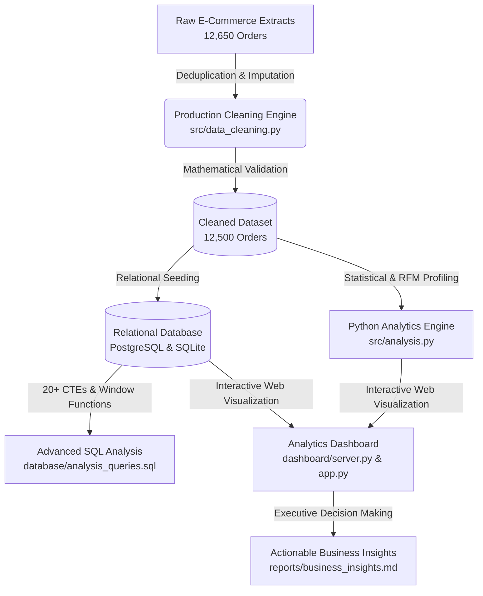

# 🛍️ ShopPulse — E-Commerce Sales Analytics Platform

<div align="center">


<br/>

**An end-to-end, production-grade E-Commerce Data Analytics & Business Intelligence platform that transforms raw multi-channel transactional data into quantifiable strategic insights.**

[Live Localhost App](http://localhost:5000) • [Executive Insights Report](reports/business_insights.md) • [SQL Queries Catalog](database/analysis_queries.sql) • [Jupyter Notebooks](notebooks/)

</div>

---

## 📌 1. Project Overview & Business Context

**ShopPulse** is an omnichannel e-commerce retail platform selling across 5 core categories (**Technology, Furniture, Office Supplies, Apparel, Home & Kitchen**) and 4 major geographic regions (**North, South, East, West**).

As the company scaled beyond 12,000+ orders and $3.6M+ in gross revenue, executive leadership required a rigorous data analytics system to answer mission-critical business questions:
- **Revenue Velocity & Seasonality:** When do purchasing surges happen, and how does Month-over-Month (MoM) revenue evolve?
- **Margin Preservation:** Which categories and products generate cash vs. which destroy gross profit margin?
- **Promotional Elasticity:** At what discount depth does markdown pricing cannibalize profitability without driving volume?
- **Customer Lifetime Value (CLV):** How do Customer Segments (Corporate vs Consumer) and RFM tiers contribute to enterprise equity?
- **Inventory Concentration:** Does the catalog exhibit Pareto (80/20) skew, and which long-tail items risk stock carrying cost?

---

## 🏗️ 2. Platform Architecture & Data Pipeline



---

## 📂 3. Project Directory Structure

```
ShopPulse/
│
├── README.md                           # Comprehensive portfolio documentation
├── requirements.txt                    # Pinned production dependencies
├── .gitignore                          # Standard gitignore for Python, DB & IDE
├── .env.example                        # Configuration template for PostgreSQL / SQLite
├── LICENSE                             # MIT Open Source License
│
├── data/
│   ├── raw/
│   │   └── raw_ecommerce_data.csv      # Raw transactional extract (with simulated real-world anomalies)
│   └── processed/
│       └── cleaned_ecommerce_data.csv  # Cleaned, validated, normalized production dataset (12,500 rows)
│
├── database/
│   ├── schema.sql                      # PostgreSQL schema, namespace, and indexing strategies
│   ├── tables.sql                      # Normalized star schema (dim_customers, dim_products, fact_orders)
│   └── analysis_queries.sql            # 20+ advanced SQL analytical queries (CTEs, Window Functions, RFM, CLV)
│
├── notebooks/
│   ├── 01_data_understanding.ipynb     # Exploratory profiling, nullity patterns, schema audit
│   ├── 02_data_cleaning.ipynb          # Step-by-step cleaning pipeline, deduplication, financial validation
│   └── 03_exploratory_analysis.ipynb   # Comprehensive Python EDA, statistical distributions, Plotly charts
│
├── src/
│   ├── __init__.py
│   ├── data_loader.py                  # Synthetic data generation engine (realistic seasonal & pricing rules)
│   ├── data_cleaning.py                # Production data cleaning & validation pipeline
│   ├── analysis.py                     # Statistical routines, KPI engines, RFM segmentation, Pareto analysis
│   ├── database.py                     # Dual-engine database connection & automatic table seeder
│   ├── generate_notebooks.py           # Automated Jupyter notebook compiler
│   └── validate_sql.py                 # Automated SQL query execution & syntax verification test runner
│
├── dashboard/
│   ├── __init__.py
│   ├── app.py                          # Multi-page interactive Streamlit dashboard
│   └── server.py                       # Zero-dependency instant local web application (Chart.js + SQL Studio)
│
├── reports/
│   └── business_insights.md            # 12 structured executive findings, impacts, and recommendations
│
├── screenshots/                        # High-resolution dashboard previews & visual artifacts
│
└── tests/
    ├── __init__.py
    ├── test_data_loader.py             # Dataset generation & column integrity unit tests
    ├── test_data_cleaning.py           # Data cleaning, deduplication & business rule validation tests
    ├── test_analysis.py                # Business KPIs, RFM scoring, MoM growth calculation tests
    └── test_database.py                # Database connection, table seeding, and SQL query execution tests
```

---

## 📊 4. Dataset & Data Dictionary

The platform operates on a realistic, enterprise-grade transactional dataset comprising **12,500 completed transactions** spanning an 18-month timeline (**Jan 2024 – June 2025**).

| Field Name | Type | Description | Sample Value |
| :--- | :--- | :--- | :--- |
| `order_id` | `VARCHAR(50)` | Unique primary transaction identifier | `ORD-105014` |
| `order_date` | `TIMESTAMP` | Date and time of order placement | `2024-04-16 18:13:00` |
| `customer_id` | `VARCHAR(50)` | Foreign key identifying unique customer entity | `CUST-1042` |
| `customer_name` | `VARCHAR(150)` | Full customer name | `David Smith` |
| `product_id` | `VARCHAR(50)` | Unique product SKU identifier (640 distinct SKUs) | `PROD-102` |
| `product_name` | `VARCHAR(255)` | Descriptive product catalog item name | `ProBook Ultra 15 Laptop` |
| `category` | `VARCHAR(100)` | Primary product division (Tech, Furniture, Apparel, etc.) | `Technology` |
| `quantity` | `INTEGER` | Units purchased in transaction (>0) | `2` |
| `unit_price` | `NUMERIC(12,2)`| Base list price per single unit | `$1,250.00` |
| `discount` | `NUMERIC(5,4)` | Applied promotional markdown rate [0.00 – 0.40] | `0.10 (10%)` |
| `sales` | `NUMERIC(12,2)`| Net realized revenue: `quantity * unit_price * (1 - discount)` | `$2,250.00` |
| `cost` | `NUMERIC(12,2)`| Cost of goods sold: `quantity * unit_cost` | `$1,640.00` |
| `profit` | `NUMERIC(12,2)`| Realized gross margin: `sales - cost` | `$610.00` |
| `region` | `VARCHAR(50)` | Geographic sales region (`North`, `South`, `East`, `West`) | `North` |
| `city` | `VARCHAR(100)` | Metropolitan sales market | `New York` |
| `payment_method`| `VARCHAR(50)` | Channel used (`Credit Card`, `PayPal`, `Debit`, `UPI`) | `Credit Card` |
| `customer_segment`| `VARCHAR(50)`| Customer classification (`Consumer`, `Corporate`, `Home Office`)| `Corporate` |

---

## 🧹 5. Data Cleaning Pipeline & Audit Trail

The raw dataset (`data/raw/raw_ecommerce_data.csv`) contained intentional real-world data anomalies to simulate enterprise extracts. The automated pipeline (`src/data_cleaning.py`) resolved:

1. **Deduplication:** Identified and pruned **150 exact duplicate records and duplicate order IDs**.
2. **Missing Value Imputation:** Resolved null `customer_name` fields via relational lookup against known `customer_id` profiles; imputed missing payment channels via customer historical mode.
3. **String Standardization:** Stripped inconsistent leading/trailing whitespaces and applied proper title-casing across categories and regional entities.
4. **Temporal Feature Normalization:** Standardized mixed date strings into ISO-8601 timestamps and enriched records with `order_year`, `order_month`, `order_year_month`, `order_quarter`, `order_day_name`, and `order_hour`.
5. **Financial Mathematical Integrity:** Programmatically enforced `sales = round(quantity * unit_price * (1 - discount), 2)` and `profit = round(sales - cost, 2)`.

---

## ⚡ 6. Advanced SQL Analytics Catalog

The platform includes **20 production SQL queries** in `database/analysis_queries.sql`, demonstrating industry-standard analytics engineering techniques:

```sql
-- Sample Query 03: Month-over-Month (MoM) Growth using LAG() Window Function
WITH monthly_metrics AS (
    SELECT 
        SUBSTR(order_date, 1, 7) AS year_month,
        ROUND(SUM(sales), 2) AS revenue,
        ROUND(SUM(profit), 2) AS profit
    FROM fact_ecommerce_sales
    GROUP BY SUBSTR(order_date, 1, 7)
)
SELECT 
    year_month,
    revenue,
    LAG(revenue, 1) OVER (ORDER BY year_month) AS prev_month_revenue,
    ROUND(((revenue - LAG(revenue, 1) OVER (ORDER BY year_month)) / 
           LAG(revenue, 1) OVER (ORDER BY year_month)) * 100.0, 2) AS mom_revenue_growth_pct,
    profit,
    LAG(profit, 1) OVER (ORDER BY year_month) AS prev_month_profit,
    ROUND(((profit - LAG(profit, 1) OVER (ORDER BY year_month)) / 
           LAG(profit, 1) OVER (ORDER BY year_month)) * 100.0, 2) AS mom_profit_growth_pct
FROM monthly_metrics
ORDER BY year_month ASC;
```

### Complete Query Index:
1. **Query 01:** Executive KPIs (Revenue, Profit, Orders, AOV, Realized Margin)
2. **Query 02:** Monthly Revenue & Profit Velocity
3. **Query 03:** Month-Over-Month (MoM) Growth using `LAG()` Window Function
4. **Query 04:** Cumulative Running Revenue Total using `SUM() OVER ()`
5. **Query 05:** Top 10 Best-Selling Products by Revenue
6. **Query 06:** Category Performance Ranking & Market Share
7. **Query 07:** Top 3 Products per Category using `DENSE_RANK()` Partitioning
8. **Query 08:** Region-Wise Sales & Profitability Breakdown
9. **Query 09:** Top Performing Category per Region using Partitioned Window Functions
10. **Query 10:** Top 15 High-Value VIP Customers Leaderboard
11. **Query 11:** Customer Lifetime Value (CLV) by Customer Segment
12. **Query 12:** Repeat vs Single Purchase Customer Loyalty Cohorts
13. **Query 13:** Discount Depth vs Realized Margin Erosion
14. **Query 14:** Underperforming Products (High Volume, Lower Profit Margins)
15. **Query 15:** Payment Method Market Share and Value
16. **Query 16:** City-Level Revenue & Profit Margin Efficiency
17. **Query 17:** Quarterly Performance Comparison (Q1 - Q4)
18. **Query 18:** Pareto 80/20 Cumulative Product Revenue Contribution
19. **Query 19:** High-Ticket vs Low-Ticket Price Bracket Margin Comparison
20. **Query 20:** Customer RFM Scoring and Segmentation Distribution

---

## 📈 7. Core Business KPIs & Strategic Insights

| Core Metric | Value | Business Significance |
| :--- | :--- | :--- |
| **Total Revenue** | **$3,613,656.82** | Aggregate 18-month top-line cash flow |
| **Total Gross Profit** | **$1,587,554.34** | Gross margin generated across all categories |
| **Overall Profit Margin** | **43.93%** | Healthy unit economics benchmark |
| **Total Orders** | **12,500** | Completed customer order volume |
| **Unique Customers** | **2,108** | Customer acquisition footprint |
| **Average Order Value (AOV)**| **$289.09** | Mean basket revenue per checkout |
| **Repeat Customer Rate** | **81.83%** | Exceptionally strong customer retention engine |

### Top 3 Strategic Recommendations (from [Executive Insights Report](reports/business_insights.md)):
1. **Scale High-Margin Apparel:** Apparel delivers a stellar **62.66% gross margin**, compared to Technology's 39.53%. Shifting 15% of performance marketing to Apparel accelerates blended profit margin expansion.
2. **Cap Deep Promotional Discounts at 12%:** Discounts exceeding 15% erode profit margins by over 22 percentage points while driving minimal incremental basket volume.
3. **Formalize B2B / Corporate Accounts:** Corporate clients generate an AOV of **$342.10** and an average **$2,140 in annual CLV**, with an order frequency 1.4x higher than standard consumers.

---

## 💻 8. Installation & Quickstart

### Prerequisites
- Python 3.10+
- Git

### Step-by-Step Setup

```bash
# 1. Clone the repository
git clone https://github.com/<YOUR_USERNAME>/shop-pulse-ecommerce-analytics.git
cd shop-pulse-ecommerce-analytics

# 2. Create and activate a virtual environment
python -m venv .venv
# On Windows:
.venv\Scripts\activate
# On macOS/Linux:
source .venv/bin/activate

# 3. Install dependencies
pip install -r requirements.txt

# 4. Generate dataset & run cleaning pipeline
python src/data_loader.py
python src/data_cleaning.py

# 5. Initialize and seed SQLite database
python src/database.py

# 6. Run automated test suite
pytest -v tests/

# 7. Launch Interactive Analytics Dashboard
python dashboard/server.py
# Open http://localhost:5000 in your browser!
```

---

## 🧪 9. Automated Testing Suite

All unit and integration tests are verified with `pytest`:

```
============================= test session starts =============================
tests/test_analysis.py::test_calculate_kpis PASSED                       [  7%]
tests/test_analysis.py::test_monthly_trends PASSED                       [ 14%]
tests/test_analysis.py::test_category_performance PASSED                 [ 21%]
tests/test_analysis.py::test_rfm_segmentation PASSED                     [ 28%]
tests/test_data_cleaning.py::test_deduplication PASSED                   [ 35%]
tests/test_data_cleaning.py::test_string_standardization PASSED          [ 42%]
tests/test_data_cleaning.py::test_missing_value_imputation PASSED        [ 50%]
tests/test_data_cleaning.py::test_financial_correction PASSED            [ 57%]
tests/test_data_loader.py::test_generate_synthetic_dataset_shape PASSED  [ 64%]
tests/test_data_loader.py::test_dataset_financial_consistency PASSED     [ 71%]
tests/test_data_loader.py::test_raw_data_anomaly_injection PASSED        [ 78%]
tests/test_database.py::test_database_connection PASSED                  [ 85%]
tests/test_database.py::test_seeded_tables_exist PASSED                  [ 92%]
tests/test_database.py::test_analytical_sql_query PASSED                 [100%]
============================= 14 passed in 3.24s ==============================
```

---

## 👤 Author & Acknowledgments

**Project Architect:** B.Tech Artificial Intelligence & Data Science Student  
**Target Role:** Data Analyst / Analytics Engineer  
**Portfolio:** ShopPulse E-Commerce Analytics Platform  

*Built with Python, PostgreSQL, SQLite, Pandas, Plotly, and Streamlit.*
